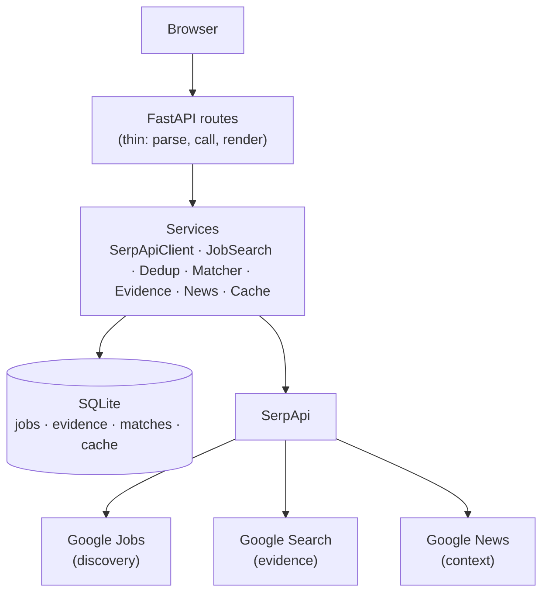

# JobTracker

Evidence-powered job intelligence for Indian freshers.

## What it does

JobSetu turns a raw job search into a decision card. Search a role + city →
get deduplicated listings, each with a deterministic match score against your
profile, a VERIFY section backed by cited search evidence, recent company news
context, and an aggregate "what should I learn next?" skill-gap panel.

## Why it exists

Fresher job boards answer "what exists" but never the three questions that
matter: **is this relevant to me, can I trust this company, what am I
missing?** JobSetu answers all three on one card per job — with sources, not
black-box scores.

## Key features

- Live fresher job search (Hyderabad-first, works for any Indian city)
- Exact + TF-IDF similarity deduplication with honest pipeline counts
- Candidate profile with explainable match breakdowns (WHY THIS MATCHES)
- VERIFY badges (Supporting evidence / Needs verification / Warning signals)
  with inspectable per-job evidence pages — every claim cites its source
- News context (layoffs, funding, expansion…) with recency, categories, sources
- Skill-gap frequency ("missing in N of M jobs")
- Candidate-reported selection-process context (interview stages with
  per-stage report counts; anecdotal stages labeled)
- Credit-efficient SQLite caching with LIVE/CACHED transparency + stale fallback
- Credit visibility: `/debug/usage` logs every SerpApi attempt per engine
- Warm-cache demo seeding: `python -m app.demo_seed`
- Landing guide (How it works, pillars, SerpApi story, FAQ), friendly 404 page

## How SerpApi is used

SerpApi is the data backbone, not a search box. Remove it and the product has
nothing — no listings, no evidence, no news. All traffic goes through the
single `SerpApiClient` (`app/services/serpapi_client.py`); routes never see
raw SerpApi JSON.

| Pillar | Engine | Query | Use |
|---|---|---|---|
| Discovery | `engine=google_jobs` | `q=<role>`, `location=<city>, India`, `gl=in`, `hl=en`, up to 2 pages via `next_page_token` | Job listings (`jobs_results[]`) |
| VERIFY | `engine=google` | Per top-5 job: `"<company>" "<title>"` and `"<company>" <city>` | Independent company/role/location evidence |
| News context | `engine=google_news` | Per top-3 job: `"<company>" <city>` | Recent headlines with dates/sources |
| Selection process | `engine=google` | Per top-3 job: `"<company>" "<title>" interview experience` + `"<company>" interview process freshers` | Candidate-reported interview stages (never scraped, only search results) |

Credit bounds per search: cold ≤21 calls (2 jobs + ≤10 evidence + ≤3 news +
≤6 interviews),
warm 0 (SQLite cache: jobs 24h, evidence/news 7d). Every attempt is logged to
`api_usage`, viewable at `/debug/usage`. Details: `docs/research.md`
(verified params/responses), `docs/verification.md` (evidence rules).

## Tech stack

Python, FastAPI, SQLAlchemy, SQLite, Pydantic v2, Jinja2, vanilla CSS/JS,
httpx, pytest. No LLM, no vector DB, no frontend framework — by design.

## Architecture



Flow: Browser → FastAPI routes → services → SQLAlchemy → SQLite.
Details: `docs/architecture.md`. Verification rules: `docs/verification.md`.
Matching formula: `docs/matching.md`. Demo tour: `docs/demo.md`.

## Prerequisites

- Python 3.12+ (`python --version`)
- `pip`
- A SerpApi key for live data ([free plan: 250 searches/month](https://serpapi.com/users/sign_up?plan=free&utm_source=india_hackathon_26)).
  Without a key the app still boots and all tests pass, but live search
  returns a friendly "not configured" page instead of fake data.

## Installation

```powershell
git clone https://github.com/AbhiramMandala/jobsetu.git
cd jobsetu
python -m venv .venv
.\.venv\Scripts\Activate.ps1
pip install -r requirements.txt
copy .env.example .env
```

Then add your key to `.env` (never commit it):

```
SERPAPI_KEY=your-key-here
```

## Environment variables

| Name | Default | Notes |
|---|---|---|
| `SERPAPI_KEY` | empty | Server-side only. Required for live search. |
| `DATABASE_URL` | `sqlite:///./jobsetu.db` | Local SQLite file. |
| `EVIDENCE_MAX_JOBS` | `5` | Top-N jobs enriched per search (credit control). |
| `NEWS_MAX_JOBS` | `3` | Top-N jobs with news context (credit control). |
| `ENABLE_NEWS` | `false` | Reserved P1 flag. |
| `ENABLE_MAPS` | `false` | Reserved P1 flag. |
| `ENABLE_TRENDS` | `false` | Reserved P1 flag. |
| `ENABLE_PDF` | `false` | Reserved P1 flag. |

## Running locally

```powershell
python -m uvicorn app.main:app --reload
```

Open `http://127.0.0.1:8000`, create your profile at `/profile`
(or use the labeled sample-data prefill), then fill role + location and
press Find jobs. Match scores appear only when a profile exists.

Warm the demo cache first (recommended for demos — instant, zero calls):

```powershell
python -m app.demo_seed
```

Requires `SERPAPI_KEY`. Runs the demo search end-to-end, creates the sample
profile if none exists, warms jobs + evidence + news caches, and prints
measured request counts and elapsed time.

Check health (secret-free): `GET /health` → `{"status": "ok"}`.

Run tests (SerpApi mocked — no key needed):

```powershell
python -m pytest
```

88 passed.

## Example workflow

1. Create a profile at `/profile`: Python, FastAPI, Django, PostgreSQL, Git.
2. Search `Python Backend Developer` in `Hyderabad` as `Fresher`.
3. Note the pipeline counts ("N listings → M duplicates removed → K unique")
   and the LIVE/CACHED badge.
4. Open the top card: match score + breakdown, matched vs missing skills.
5. Click VIEW EVIDENCE: 2–3 cited Google Search sources with queries and
   retrieval times behind the VERIFY badge.
6. Read NEWS CONTEXT (e.g. funding/expansion with source + date), then the
   "What should I learn next?" panel. Apply or learn the missing skill first.

## Screenshots / demo

Real UI captures (no demo data fabricated; profile shows clearly-labeled
sample data):

- `docs/screenshots/01-landing.png` — search form
- `docs/screenshots/02-profile.png` — profile with labeled sample prefill
- `docs/screenshots/03-usage.png` — dev credit dashboard
- `docs/screenshots/results.png` — search form (landing, live-seeded DB)
- `docs/screenshots/profile.png` — profile page with demo fresher data
- `docs/screenshots/usage-live.png` — live-seeded results page: 19 listings,
  CACHED badge, 63% top MATCH, VERIFY supporting evidence, skill gaps

Evidence-detail and `/debug/usage` captures are optional extras.
Demo script (2:45, video intentionally skipped): `docs/demo.md`.

## Project structure

```
app/
  main.py            # FastAPI entrypoint (create_app)
  config.py          # env-based settings (SERPAPI_KEY never hardcoded)
  database.py        # SQLite engine/session, health check
  demo_seed.py       # python -m app.demo_seed warm-cache command
  data/skills.py     # curated skill vocabulary + extractor
  models/            # SQLAlchemy: jobs, companies, evidence, matches, cache
  schemas/           # Pydantic: JobItem, organic/news result parsers
  services/          # serpapi_client, job_search, deduplicator, matcher,
                     # evidence, news, normalizer, cache
  routes/            # health, pages, search, evidence, profile, debug
  templates/ + static/
tests/               # 88 tests, SerpApi fully mocked
docs/                # architecture, matching, verification, research, demo…
Dockerfile  .dockerignore  requirements.txt  .env.example
```

## API / search flow

`POST /search` (form: `role`, `location`, `experience`) is the fast path —
discovery only, then renders useful cards immediately:
1. Validate input (empty → friendly 400 on the form, no traceback).
2. Cache lookup (SQLite, 24h). Hit → render CACHED with age, 0 SerpApi calls.
3. Miss → `SerpApiClient.google_jobs` (≤2 pages) → normalize → source-key
   upsert → TF-IDF fuzzy dedup → skill extraction → deterministic match
   refresh → commit pipeline counts. Deduplication always precedes any
   expensive work.
4. Pure derivations inline (no HTTP): authenticity score, company-type
   estimate. Cards render with loading placeholders for deep sections.
5. The page then fetches `GET /api/enrich/{verify,news,interview}?search_id=N`
   in parallel; each endpoint is cache-first under the existing caps and
   renders server-side partials (or honest unavailable states). A fresh
   search loads a new page, abandoning in-flight enrichment automatically.
6. Failure anywhere → stale cache with warning banner; no stale cache →
   friendly 503. Never fake data. Optional-enrichment failure never breaks
   the core search. Details: `docs/performance.md`.

## Selection process

Each card also shows a SELECTION PROCESS section built only from
SerpApi organic-search results — JobSetu never scrapes review sites and
never bypasses logins, CAPTCHAs, paywalls, or robots rules. Interview stages
(online assessment, technical, HR, …) carry per-stage report counts
("reported in 3 of 5 available candidate reports"); single-report stages are
labeled anecdotal, and everything is marked candidate-reported — never
official company policy. Every stage links to its sources for inspection.
Details, taxonomy, and limits: `docs/interviews.md`.

## Appearance & tools

- **Light/dark theme:** toggle in the header (sun/moon button), persisted in
  `localStorage`, falls back to the OS `prefers-color-scheme` setting, applied
  before first paint (no flash), and disabled animation under
  `prefers-reduced-motion`. Every surface uses CSS variables.
- **Useful Tools page** (`/tools`): a small curated set of career/developer
  resources with search + category filters (including `?q=` presets, used by
  per-topic "Practice in Useful Tools" links); external links open safely in
  a new tab. Curated starter set — not scraped from anywhere.
- **Results filters:** verification-status and company-type filters work
  instantly on rendered cards (client-side, zero extra searches).
- **Role intelligence:** each card links to its evidence page with company
  facts (type estimate + confidence, official site), role skills, interview
  prep topics with report counts, selection process, news, and sources.

## Tracker integration

JobSetu discoveries can be pushed into the Cloudflare **Student Job Tracker**
(`../cloudflare`) as `SAVED` applications, both directions:

- **Export API** (read-only, no auth): `GET /api/searches` (recent searches
  for the Discover picker), `GET /api/jobs?search_id=N`, and
  `GET /api/jobs/{id}/tracker-export` (payload shaped for the Tracker's
  `POST /api/applications`). CORS allows the Tracker frontend.
- **Save to Tracker button:** every results card signs you into the Tracker
  API (email + password asked once; only the token is kept in `localStorage`)
  and saves the job. The API URL prompt is prefilled from `TRACKER_API_URL`.
- **Tracker Discover page:** the Tracker frontend lists recent JobSetu
  searches and imports listings.
- Tests: `tests/test_tracker_export.py` (5 tests).

### URLs are env-configured (no hardcoded ports)

| Variable | Default (local) | Production |
|---|---|---|
| `TRACKER_API_URL` | `http://127.0.0.1:8787` | `https://<worker>.<subdomain>.workers.dev` |
| `TRACKER_WEB_ORIGINS` | local `:5173` built in | `https://<pages>.pages.dev` (comma-separated) |

Mirror settings on the Tracker side: `VITE_JOBSETU_URL` (frontend build),
`JOBSETU_ORIGIN` (Worker). See the Tracker README's deployment table.

## Credit visibility

`/debug/usage` (dev-only, no auth) shows real per-engine call counts,
cache entries, and stored rows. The API key is never displayed.

## Deployment

```powershell
# Environment (never commit .env)
SERPAPI_KEY=<key>            # required for live data
DATABASE_URL=sqlite:////data/jobsetu.db
EVIDENCE_MAX_JOBS=5
NEWS_MAX_JOBS=3
PORT=8000
```

Docker (SQLite persisted on a volume):

```powershell
docker build -t jobsetu .
docker run -p 8000:8000 -e SERPAPI_KEY=<key> -v jobsetu-data:/data jobsetu
```

Or any Python host (Render/Railway/HF Spaces): install requirements,
set env vars, serve `uvicorn app.main:app --host 0.0.0.0 --port $PORT`.
Health: `GET /health` (no secrets). Then warm the demo:
`python -m app.demo_seed`.

Status: Dockerfile + `.dockerignore` ready; image build and platform deploy
not yet executed (no Docker daemon/credentials in this environment).

## Matching

Deterministic and explainable: Skills 50 + Title 20 + Experience 15 +
Location 10 + Type 5 = 100. Same candidate + same job always gives the same
score. Missing data yields neutral sub-scores with explicit flags, never
fake precision. Full formula, weights, and limitations: `docs/matching.md`.

## Verification

Each search enriches the top-`EVIDENCE_MAX_JOBS` listings with live Google
Search evidence (cached 7 days): official-site detection, company/role
presence, location support. Statuses are Supporting evidence, Needs
verification, or Warning signals — no numeric trust scores, and every claim
links to its source on `GET /jobs/{id}/evidence`. Rules and limitations:
`docs/verification.md`.

## Job Authenticity

Each card also carries an evidence-based authenticity score (0–100) with
explained signals — and a clear statement of what the score is NOT:

- **What it checks:** company verification, job-post consistency across
  independent sources, application-channel signals (official domain vs free
  email / WhatsApp / Telegram / fee requests), and suspicious content patterns
  (guaranteed income, no interview, urgency pile-ups).
- **What it means:** 90+ Strong supporting evidence · 75+ Higher confidence ·
  50+ Mixed — verify · 25+ Significant risk signals · 0–24 High risk — verify
  carefully. UI categories, not fraud probabilities.
- **What it does NOT mean:** it never claims a job is real/fake, legitimate/
  fraudulent, or guaranteed anything. Scores without independent evidence are
  capped at 49 and say so.
- **SerpApi role:** the analyzer reuses already-stored SerpApi evidence and
  makes zero new calls (no credit cost). Structured output:
  `GET /jobs/{id}/authenticity`. Full formula: `docs/authenticity.md`.

> "This score is an evidence-based risk indicator, not a guarantee that a job
> is legitimate or fraudulent. Always verify the employer and application
> channel before sharing sensitive information or making payments."

## Limitations

- Closed skill vocabulary (curated list; misses niche/brand-new skills).
- Keyword-based experience/news parsing (can misread unusual phrasing).
- Website heuristic can misfire on single-token company names.
- Small employers with little web presence may show "needs verification"
  (wording guards against overreach; never claims scam/fake/safe).
- Cold searches are sequential (~21 calls max); warm is instant.
- Plain server-rendered visuals; no maps/trends depth, alerts, or LLM
  explanations.

## Future improvements

- Maps/Trends depth behind the existing `ENABLE_*` flags.
- Search alerts for new matching listings.
- Larger/industry-specific skill vocabularies.
- LLM-generated match explanations (deterministic scores stay as-is).

## Hackathon information

- Event: SerpApi India Hackathon 2026 — "Build with Live Search Data"
  (Sep 1–Oct 10, 2026; deadline Oct 10, 2026 23:59 IST).
- Track: **Knowledge & Public Interest** — official track keywords explicitly
  include jobs, news, research, and education; JobSetu is a jobs + news-literacy
  tool for Indian freshers.
- Entry: solo contributor (Abhiram Mandala).
- Submission docs: `HACKATHON_SUBMISSION.md` (full package),
  `SUBMISSION_FORM_DRAFT.md` (copy-paste form answers), `docs/demo.md` (2:45 demo).
- Disclosures: project built during the hackathon window (see git history);
  AI assistance used (OpenCode + ChatGPT, see `HACKATHON_SUBMISSION.md`).
